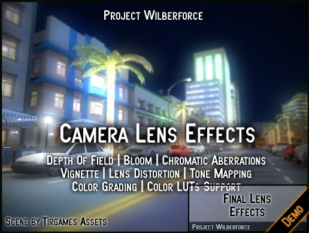

# Final Lens Effects 1.2 Demo

We provide a free evaluation version of our Final Lens Unity plugin (with watermark).

It contains all the features of a full version, except it does not run on Unity 5.6 (only Unity 2017.1 and higher). 

If you like Final Lens Effects and want to use it please buy it at [Unity Asset Store](http://u3d.as/Sgg) to support its development. Also let us know what you think, your feedback is welcome.

<a href="https://projectwilberforce.github.io/cameralens/demo/CameraLensEffects_1_2_Demo.unitypackage" class="downloadbtn">Download Demo</a>
   
Also See:

 - [User Manual](https://projectwilberforce.github.io/cameralens/manual)
 - [Asset Store Link](http://u3d.as/Sgg)
 - [Forum Thread](https://forum.unity.com/threads/final-lens-effects-image-effect.530606/)
 - [Our Other Projects](https://www.assetstore.unity3d.com/en/#!/search/page=1/sortby=popularity/query=publisher:22764)

# Installation

1. From Unity menu select *Assets -> Import Package -> Custom Package...*
2. Locate and select file *CameraLensEffects_1_2_Demo.unitypackage*  
3. Click *Import*   
5. Attach *Camera Lens* effect to *Camera* and you can change settings in the *Inspector*.
6. For more details on the settings check the plugin [user guide](/cameralens/manual)

# Contact Information
In case of questions or further issues, please contact us at <projectwilberforce@gmail.com>

