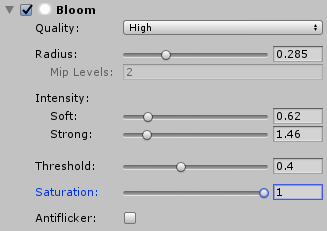

# Contents
- [About Final Camera Effects Pro](#about-final-camera-effects-pro)
- [Requirements](#requirements)
- [Quick Start Guide](#quick-start-guide)
- [Effects How-to](#effects-how-to)
    - [Distortion](#distortion)
    - [Chromatic Aberrations](#chromatic-aberrations)
    - [Depth of Field (Bokeh)](#depth-of-field-bokeh)
    - [Bloom](#bloom)
    - [Vignette](#vignette)
	- [Color Grading & Tone Mapping](#color-grading--tone-mapping)
- [Controls walk-through](#controls-walk-through)
- [Contact Information](#contact-information)

# About Camera Lens Effects

Final Camera Effects Pro package is a collection of image effects for simulating some properties of real camera lens such as depth of field, vignetting and distortion for Unity 5 (5.6 or higher). Package contains following effects:

 - Depth of field effect with polygonal aperture (Bokeh)
 - Bloom effect
 - Vignetting
 - Chromatic aberrations
 - Lens distortion
 - Color Grading
 - Tone Mapping (ACES)
 - Color LUTs Support

You can buy this package at [Unity Asset Store](http://u3d.as/Sgg).

There is a watermarked [demo available at our pages](https://projectwilberforce.github.io/cameralens/demo).
 
These effects can be used to make your scenes look closer to as if they were captured with real camera and lens - making computer generated graphics look more natural or to achieve the "cinematic look" for cut scenes or in-game. Being very tweakable, the effects can be combined, reordered, customized and overdone to create interesting looks or visual effects.

All the effects are optimized and designed to work well together to get best performance and visual quality. Effects are attached to camera and are applied as a post-processing step - this way, performance is dependent on screen resolution only and not on the scene complexity.

Using powerful tone mapping and color grading controls (which include support for 3rd party color LUTs) you can adjust final look of the scene to match your artistic vision.

Our depth of field implementation provides interesting additional feature - polygonal aperture simulation. This can be used e.g. to make bright out of focus spots create a desired shape (hexagon/octagon/...) just like with real lens. Vignetting provides also desaturation mode to affect color saturation rather than brightness of the image and possibility to use custom colors for vignette. Bloom comes with many options to control range and intensity of the effect.

Package comes with full source code for both C# script and the shader.

Please rate our plugin on the asset store and contact us with issues or feature suggestions. See forum for discussion and contact us at <projectwilberforce@gmail.com> for additional support.

## Requirements

- Unity 5, 2017 or 2018 (5.6 or higher; all editions including Personal)
- Shader Model 3.0:  
*NVIDIA cards since 2004 (GeForce 6)*  
*AMD cards since 2005 (Radeon X1300)*  
*Intel cards since 2006 (GMA X3000)*
- Works on desktop platforms: DirectX 9 and higher, OpenGL
- Windows, Mac, Linux, WebGL
- Not tested on mobile

# Quick Start Guide

1. Attach Final Camera Effects Pro effect to camera using either **Add Component -> Image Effects -> Rendering -> Final Camera Effects Pro** or by **dragging & dropping FinalCameraEffectsPro.cs file to camera**.
2. Select camera in **Hierarchy** window and use controls in **Inspector** to control the effect.
3. We recommend enabling **Allow HDR** option on the Unity camera to get most out of bloom and depth of field effects.
4. Turn on effects you want to use and tweak their respective controls to get desired looks. See manual for description of all accessible controls of individual effects.
5. Use **Effects Order Settings** foldout to change order of individual effects if desired.

# Effects How-to

## Distortion

Lens distortion occurs when lens fails to project straight lines in the world as straight lines in the image - our implementation can simulate either barrel or pincushion shaped distortion.

Use provided **slider** to set shape and amount of distortion. **Anamorphic Lens** toggle takes aspect ratio of the screen into account.

## Chromatic Aberrations

Because camera lens cannot focus all wavelengths to the same point, color fringes occur around color boundaries - the result is called chromatic aberration. Visible most notably as "rainbow colors" around bright areas. The effect can be overdone on purpose and animated to get interesting results.

Our implementation works by using color spectrum instead of a simple RGB model therefore getting more accurate results.

Start by setting desired **Size** and **Linearity** - how fast aberrations enlarge from screen center to corner. We also provide slider to adjust spectrum itself to model various types of lenses.

## Depth of Field (Bokeh)

Depth of field effect simulates defocused (blurred) areas in the foreground and background around the focal plane. Our implementation can also simulate various shapes of aperture opening.

To use the effect, set **Focus distance** control to desired distance first and other controls to get desired look. Please note that different aperture shapes have different performance - circular and rectangular are fastest, octagonal and pentagonal slowest. Control amount of "blurriness" by adjusting **Aperture Diameter**.

**Performance tip**

Use **Fast** algorithm option to get best performance along with simpler aperture shape. For even more performance boost you can use **Background only** option for **Defocus Areas** control if you don't need blurry foreground areas.

## Bloom

Bloom effect is caused by very bright light oversaturating the capturing sensor (or film medium) to the point when light spreads (blooms) from given point on the sensor (pixel) to surrounding pixels.

Start by setting **Threshold** first to control which surfaces will bloom. Then use **Radius** to set how far will bloom reach and **Intensity** controls to set bloom strength. Note that radius and intensity controls are interactive on higher values. If you notice sharp edges around bloom you will need to increase radius or decrease intensity.

Use **Soft Intensity** to make effect stronger near the source, **Strong Intensity** to make it stronger overall.

Our implementation uses mip-mapping to speed up the effect and will automatically set number of mip levels based on radius control, intensity controls and screen resolution - number of mip levels used is indicated under radius control.

**Saturation** slider affects color saturation of blooming areas. **Antiflicker** option can get rid of flickering bright spots by averaging their brightness from previous frames (temporal antiflickering filter) but it costs performance.

## Vignette

Vignetting displays as a reduced brightness or saturation near the corners of the image. Our implementation also lets you choose any color for center and corners.

Set desired **minimum and maximum brightness** in the corners and the center of the screen. **Falloff Linearity** controls the curve of the falloff from the center to corners (how fast is brightness reduced towards the corners). Set the **minumum and maximum distances** at which are brightness min/max values achieved.

Mode lets you select between standard brightness reduction, saturation reduction or custom colors you want to use.

It is convenient to enable debug display via **Show Debug Output** switch to fine-tune vignetting.

## Color Grading & Tone mapping

Tone Mapping refers to process of mapping HDR values back to normal range suitable for display. By tweaking tone mapping controls you can balance highlights and shadows, overall contrast and final look of the scene.

Color grading adjusts final colors of the scene either using three color curves (one for each of RGB channels) or by using custom color LUT texture (plugin accepts wide range of color LUTs from 3rd parties).

# Controls walk-through

## Rendering Pipeline settings

**Integration Type**

Way of integration of effect within Unity - image effect or command buffer. Note that command buffer implementation may not work correctly with HDR rendering changing results of bloom and depth of field effects significantly.

**Far plane source**

Where to take far plane distance from. Camera is needed for post-processing stack temporal AA compatibility. Use Projection Params option for compatibility with other effects.

**G-Buffer Depth&Normals**

Take depth&normals from GBuffer of deferred rendering path, use this to overcome compatibility issues or for better precision.

**High precision depth buffer**

Uses higher precision depth buffer (forward path only). This may also fix some materials that work normally in deferred path.

## Effects Order settings

Lets you change order in which are effects applied - only limited number of possible ways is provided but these should be enough to cover all outcomes possible.

## Distortion

**Amount**
Slider sets shape and amount of distortion.

**Anamorphic Lens**
Takes aspect ratio of the screen into account.

## Chromatic Aberrations

**Intensity**
Intensity of chromatic aberrations.

**Size**
Size of chromatic aberrations.

**Linearity**
Size based on distance from image center (makes aberrations larger in corners).

**Quality**
Number of samples used to calculate the effect - affects visual quality and performance.

**Spectrum**
Sets minimum and maximum wavelength that will be used for the effect.

**Anamorphic Lens**
Takes aspect ratio of the screen into account.

## Depth of Field (Bokeh)

**Algorithm**
Either Fast or Precise - Faster version uses down-sampling and additional blur step to achieve higher speed and might even look better than precise for some scenes.

**Focus Distance**
Distance of focal plane from camera - distance in which sharpest focus is achieved.

**Aperture Diameter**
Diameter of aperture opening - larger will create more defocused foreground and background. Only available for realistic thin lens model - disabled when **from parameters** setting is used.

**Softness**
Lower value makes out of focus areas appear sharper - especially bright highlights in HDR. (Only available for non-circular aperture shapes)

**Aperture Shape**
Shape (number of blades) of the aperture opening. Different aperture shapes have different performance - circular and rectangular are fastest, octagonal and pentagonal slowest.

**Aperture Rotation**
Rotation angle of the aperture.

**Defocus Areas**
Create defocused areas in the background/foreground only or both based on focal plane distance.

**Quality**
Lower quality might be acceptable for smaller aperture diameters or for better performance.

### Lens parameters - Realistic Thin Lens Model

These parameters affect size of bokeh (amount of blur) based on distance from focal plane.

**Lens Model**
Thin lens model is realistic and lets you set parameters as for physical lens. 'From Parameters' option lets you set distances for maximum defocus from focal plane and curve shape.

**Focal Length Source**
Calculate focal length from Unity's camera vertical field of view (FOV) or set manually.

**Focal Length**
Focal length of lens in millimeters.

**Sensor Height**
Height of camera sensor/film frame in millimeters.

### Lens parameters - From parameters

**Distance Parameters Mode**
Following parameters are either in absolute distances from camera or relative to focal plane.

**Defocus Size - Foreground/Background**
Maximal size of defocused areas on the screen.

**Max Defocus Distance - Foreground/Background**
Distance in which maximum defocus size is achieved.

**Curve Linearity - Foreground/Background**
Controls shape of the curve for defocus size based on distance from focal plane.

**Anamorphic Lens**
This option will simulate effect of anamorphic lens - making bokeh stretched in horizontal or vertical direction.

## Bloom

**Quality**
Determines number of samples used for calculating bloom - affects visual quality and performance.

**Radius**
Size of bloom effect (how far from bloom source it will reach).

**Mip Levels**
Number of mip levels used (selected automatically based on radius setting).

**Intensity - Soft**
Strength of the bloom effect - exponentiation part creates "soft" bloom making it stronger near the source.

**Intensity - Strong**
Strength of the bloom effect - multiplication part creates "strong" bloom making it stronger overall.

**Threshold**
Brightness threshold for controlling which areas will bloom.

**Saturation**
Color saturation of bloom effect.

**Antiflicker**
Reduces flickering of moving objects by using temporal filtering of luminance.

**Antiflicker - Length**
Number of previous frames to consider for antiflicker filter (4/8/12).

**Antiflicker - Strength**
Higher value puts more emphasis on more recent frames, causing less 'motion blur' but weakens antiflicker effect.

**Antiflicker - Fade**

## Vignette

**Min/Max Intensity**
Maximum brightness value (in the center), minimum brightness value (in the corners).

**Falloff Linearity**
Falloff curve of vignette intensity (based on distance from image center).

**Min/Max Distance**
Distance from center where minimum/maximum intensity is achieved.

**Mode**
Vignetting mode - Standard mode adjusts brightness, Saturation mode adjusts color saturation.

**Center Position**
Position of vignetting center on the screen.

**Anamorphic Lens**
Takes aspect ratio of the screen into account.

**Show Debug Output**
Displays vignetting only.

## Color Grading & Tone mapping

**HDR Tonemapper**
Turns ACES tone mapping on or off.

**Intensity**
Tonemapping curve slope - lower value means linear mapping, higher value is ACES standard curve.

**Exposure**
Exposure compensation before tone mapping.

**Gamma**
Gamma adjustment after tone mapping.

**Contrast**
Contrast adjustment after tone mapping.

**Saturation**
Saturation adjustment after tone mapping.

**Temperature**
Color temperature adjustment before tone mapping (blue - yellow range).

**Tint**
Color tint adjustment before tone mapping (purple - green range).

**Color Grading Mode**
Color correction method to use (either custom LUT texture or manual setting using RGB curves).

**Intensity**
Blends between color corrected and original image.

**LUT Texture**
LUT Texture to use for color correction.

**Red**
Red channel adjustment curve.

**Green**
Green channel adjustment curve.

**Blue**
Blue channel adjustment curve.

## Usage tips

**Getting best performance**

Depth of field is the most performance intensive effect - you should take care to set it up correctly (see performance tips in this manual). Bloom is the second most performance intensive - make sure to use quality setting and range that is acceptable. Also turn off antiflicker option when not needed. Other effects are not as performance heavy but chromatic aberrations might become slower when using large size settings and Ultra quality.

# Contact Information
In case of questions, feature requests or further issues, please contact us at <projectwilberforce@gmail.com>
