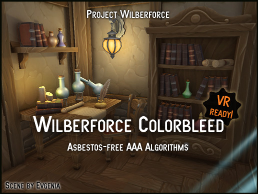
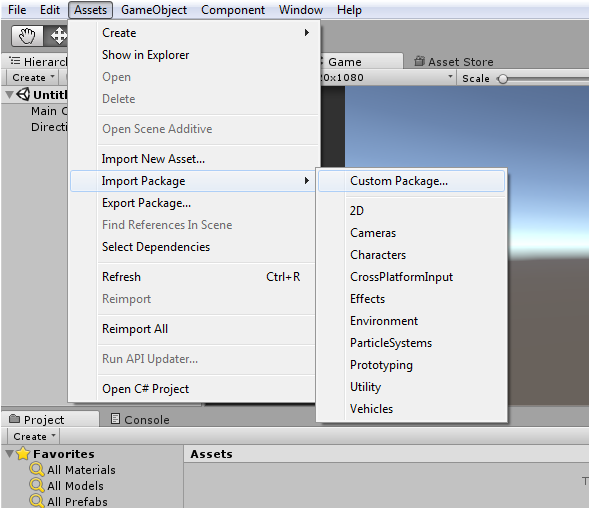
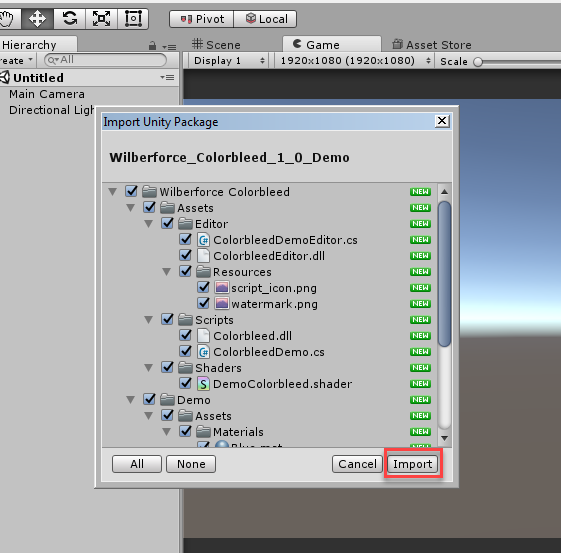
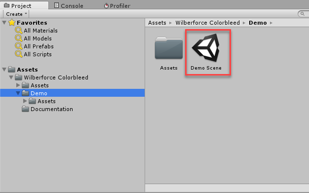
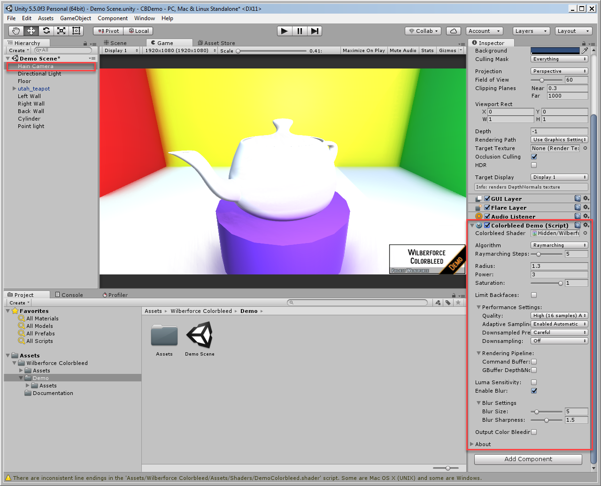

# Colorbleed 1.0 Demo

We provide a free evaluation version of our Colorbleed Unity plugin (with watermark).

It contains all the features of a full version, except it does not run on Unity 5.3 (only Unity 5.4 and higher).

If you like Colorbleed and want to use it please buy it at [Unity Asset Store](https://www.assetstore.unity3d.com/#!/content/85066) to support its development. Also let us know what you think, your feedback is welcome.

<a href="https://projectwilberforce.github.io/cbdemo/Wilberforce_Colorbleed_1_0_Demo.zip" class="downloadbtn">Download Demo</a>

Also See:

 - [User Manual](https://projectwilberforce.github.io/colorbleed)
 - [Asset Store Link](https://www.assetstore.unity3d.com/#!/content/85066)
 - [Forum Thread](https://forum.unity3d.com/threads/colorbleed-image-effect.473033/)
 - [Our Other Projects](https://www.assetstore.unity3d.com/en/#!/search/page=1/sortby=popularity/query=publisher:22764)

# Installation

1. From Unity menu select *Assets -> Import Package -> Custom Package...*

2. Locate and select file *Wilberforce_Colorbleed_1_0_Demo.unitypackage*  
3. Click *Import*   

4. In your *Project* window, open *Assets -> Wilberforce Colorbleed -> Demo -> Demo Scene*  

5. Colorbleed is attached to Main Camera, select *Main Camera* in *Hiearchy* window and you can change settings in the *Inspector*.

6. For more details on the settings check the plugin [user guide](/colorbleed)

# Contact Information
In case of questions or further issues, please contact us at <projectwilberforce@gmail.com>

