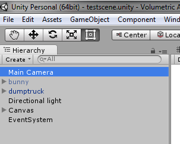
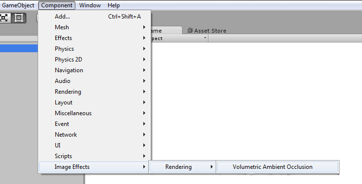
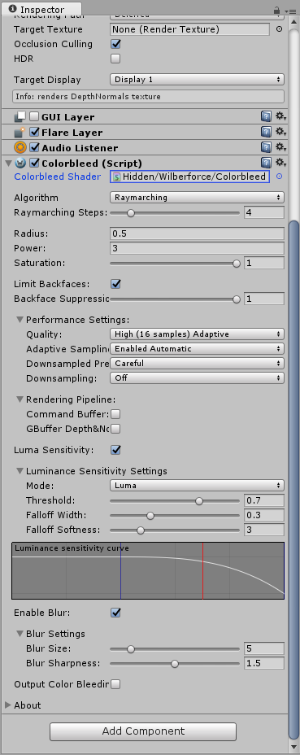
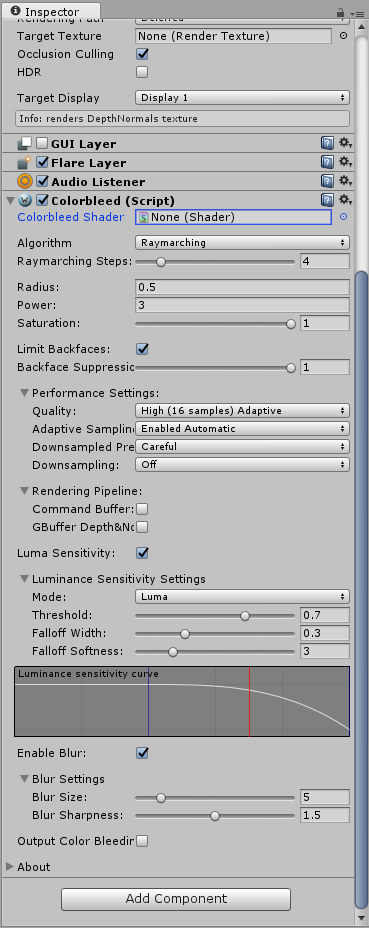

# Contents
- [Introduction](#introduction)
- [Requirements](#requirements)
- [Installation](#installation)
- [How to use](#how-to-use)
    - [Parameters](#parameters)
    - [Performance Tips](#performance-and-other-tips)
- [Troubleshooting](#troubleshooting)
    - [Attaching Shader](#attaching-shader)
- [Contact Information](#contact-information)

# Introduction

Wilberforce Colorbleed (WC) is our Screen Space Indirect Lighting Plugin for Unity 5 (5.3.6 or higher)

You can [download free demo](https://projectwilberforce.github.io/cbdemo) or buy Wilberforce Colorbleed at [Unity Asset Store](https://www.assetstore.unity3d.com/#!/content/85066).

Please consider [rating the asset](https://www.assetstore.unity3d.com/en/#!/account/downloads/search=Colorbleed) to help others discover it.

- High performance and visual quality
- Supports Single Pass Stereo Rendering (SPSR) for Virtual Reality systems
- Compatible with Unity Post Processing Stack
- Compatible with all Unity rendering paths (Forward, Deferred and Legacy) and anti-aliasing
- Luminance sensitivity
- Option to reduce self-lighting
- Customizable blur
- Works well on screen borders
- Compatible with Unity 5.3 and higher

WC adds another layer of visual quality by simulation of indirect ambient light (i.e. light that reaches the surface by bouncing off of another surface, rather than directly from light source.) This results in objects "bleeding" their color on surfaces around them, making scenes appear more realistic. This effect also adds nice atmosphere to the image.

WC started as a feature for our [Volumetric Ambient Occlusion (VAO) Plugin](http://u3d.as/xzs), and thus been in development for quite some time. Integration in VAO imposed a lot of limitations, so we decided to create a standalone color bleeding plugin without restrictions. This means that WC already implements feedback from real applications and also wide range of performance optimizations.

We provide two algorithms - "Point Cloud" for real time applications and "Raymarching" for high quality and fast hardware. Raymarching is suitable for visualizations and still renders.

Both algorithms are fully dynamic without any necessary precomputing, which means that moving objects don't pose any extra problems.

Due to its Screen Space nature the algorithm is unaffected by level of geometry detail - runs the same way on both high and low-poly scenes.

WC is implemented as an image effect that gets attached to the camera. It features a variety of user-controlled settings, which lets designer to fine-tune the final appearance and balance performance.

Plugin is compatible with Unity Post Processing Stack (Deferred rendering path), all Unity rendering paths (Forward, Deferred and Legacy) and anti-aliasing.

See [forum for discussion](https://forum.unity3d.com/threads/colorbleed-image-effect.473033/) and contact us at <projectwilberforce@gmail.com> for additional support. We are open to any questions or requests - after all this plugin started as as suggestion from one of our customers.
 
# Requirements

- Unity 5 (5.3.6 or higher; all editions including Personal)
- Shader Model 3.0:  
*NVIDIA cards since 2004 (GeForce 6)*  
*AMD cards since 2005 (Radeon X1300)*  
*Intel cards since 2006 (GMA X3000)*
- Works on desktop platforms: DirectX 9.0c and higher, OpenGL
- Windows, Mac, Linux
- Not tested on mobile and web platforms

# Installation

1. Import from Asset Store.
2. Select your camera component.  

3. From *Component* menu select *Image Effects -> Rendering -> Colorbleed*.   

4. Colorbleed effect should now be visible in the *Inspector* window.  

5. If property Colorbleed shader is not set to *"Hidden/Wilberforce/Colorbleed"* see Troubleshooting [section below](#attaching-shader) on how to fix it.  

# How to Use

## Parameters

WC effect behaviour is controlled by these parameters.

**Algorithm**
We provide two variants of the colorbleed effect.

- *Point Cloud*: Point cloud queries the color buffer once for each sample - this makes it fast and more suitable for real-time applications.
- *Raymarching*: Depth and color buffer are queried multiple times (as specified by *Raymarching Steps* parameter) at uniform intervals. This creates more accurate appearance at the cost of performance. Raymarching with lower step counts (~4) can be still usable for games applications depending on the available GPU resources. High step counts are aimed at models and scenes visualisations, screenshots etc.

**Radius**

Radius sets the distance of how far the algorithm reaches to sample surface colors. Higher radius means longer colorbleed caused by objects further away.

**Power**

Turn higher to create more pronounced result.

**Presence**

Presence makes the effect more pronounced towards the crease.

Presence turned off is closer to “physically-based” solution, however, adjust this to suit your scene and desired appearance.

You can also try increasing presence rather than radius to make effect more visible and save performance.

**Brightness**

This setting supresses the dark shadows. Use this if you want only the transfer of colors.

**Saturation**

Used to control saturation of the resulting color. When turned all the way down, the appearance is similar to [Ambient Occlusion](http://u3d.as/xzs).

**Limit Backfaces**

Makes surfaces cast color only in front of them - unlike shadows, that are cast both to the front and to the back.

**Backface Suppression**

Controls the degree of backface suppression. Note that complete suppression creates a sharp falloff of colorbleed at certain edges.

**Quality**

Number of samples used to calculate WC. Select lower settings if you need faster performance.

**Adaptive Sampling**

Adaptive sampling means lower number of samples is used on more distant areas of the image. Ideally causes no loss of detail.

- *Enabled Automatic*: Automatically determines where lower sample count should be used.
- *Enabled Manual*: Provides additional slider to fine-tune the change between the quality levels.

**Downsampled Pre-pass**

Speeds up the calculation by downsampling the parts with less colorbleed. Results in performance boost, especially for higher resolutions.

- *Greedy*: Skips areas that are below certain threshold of color in the downsampled prepass. Fast, but may cause small loss of detail.
- *Careful*: Instead of skipping computes colorbleed with low quality setting. Smaller performance gain but no loss of detail.

**Downsampling**

Reduces resolution of output, use this to gain performance at the cost of quality. Try lowering quality parameter first as this reduces quality dramatically. Having high quality setting with downsampling enabled serves no purpose.
Alternatively, use this option if you have some sort of supersampling enabled - as high pixel density would have adverse effect on performance without much visual impact.

### Rendering Pipeline

**Command Buffer**  
Insert effect via command buffer (BeforeImageEffectsOpaque event)

**GBuffer Depth&Normal**  
Take depth&normals from GBuffer of deferred rendering path, use this for better precision. Note that this feature will cause some performance drop.

**Intermediate Texture Format**  

This lets you specify texture format for mixing colorbleed command buffer with scene. *Auto* is recommended (handles switching between HDR by default).

**Far Plane Source**  

Source of Far Clipping Plane values. Some effects (notably Postprocessing Stack's Temporal Anti-aliasing) alter the *[_ProjectionParams](https://docs.unity3d.com/Manual/SL-UnityShaderVariables.html)* variable which may cause flickering. If you are planning on using TAA or similar effect enable the *Camera* option to fix this.

### Luminance Sensitivity

Reduces colorbleed effect on bright surfaces - either light sources or strongly lit areas. We recommend enabling this in combination with downsampling to reduce the most visible artifact caused by reducing of the colorbleed texture. Also use this to prevent colorbleed on lamps, windows, screens etc.

- *Enable*: Toggles the effect on/off.
- *Mode*: What represents the brightness - either luminance or value component of HSV color model.
- *Threshold*: Controls the level of surface brightness that can still be affected by colorbleed.
- *Falloff Width*: Width of the area in which is the colorbleed gradually reduced.
- *Falloff Softness*: How fast is the colorbleed reduced.

**Enable Blur**

In case you are applying your own blur after WC effect, you can try turning this off to save performance. Blur step included in WC is fast and is part of its visual appearance, so you might consider keeping it on all the time. We include controls of size and sharpness. Note that high values (e.g. 7 and above) will slow down the computation. Sharpness does not affect performance.

**Output Colorbleed only**

Use for development to display only colorbleed component.

## Performance and other tips

**Performance tips**

- Use appropriate number of samples (*Quality* setting) - high enough to hide aliasing. There is nothing wrong with using 4-8 samples when radius is small enough.
- Consider using *Downsampling* at high screen resolutions.
- Judge the quality by the final image, not Colorbleed part only.
- Use *Adaptive Sampling* and *Downsampled Pre-pass* feature.

**Disabling Colorbleed for specific objects**

If you don't want some object to cast or receive color - set *Rendering Mode* of its material to *Fade* or *Transparent*. Or use plugin's *Luminance Sensitivity* option where possible.

# Troubleshooting

## Attaching shader

When Colorbleed effect is attached to the camera, its corresponding `Colorbleed.shader` file is automatically located and bound to *Colorbleed Shader* property. If this does not happen, make sure that `Colorbleed.shader` file can be found in the *Project* window under *Assets/Shaders* folder. Then bind this shader manually by drag&dropping it to *Colorbleed Shader* property in *Inspector* window.

<figure>

<figcaption>Inspector shows no attached shader</figcaption>
</figure>
<figure>

<figcaption>Should instead look like this</figcaption>
</figure>

# Contact Information
In case of questions or further issues, please contact us at <projectwilberforce@gmail.com>

