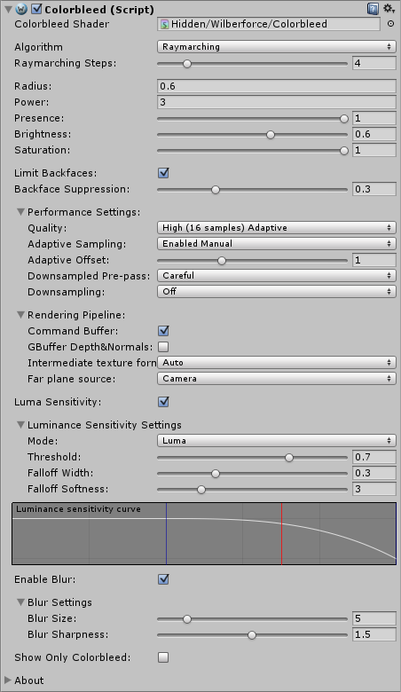
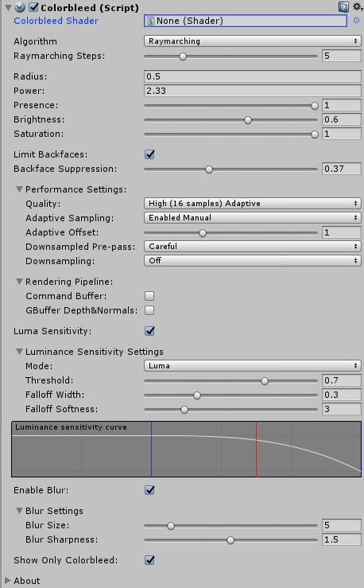

# Contents
- [Introduction](#introduction)
- [Requirements](#requirements)
- [Installation](#installation)
- [How to use](#how-to-use)
    - [Parameters](#parameters)
    - [Performance Tips](#performance-and-other-tips)
- [Troubleshooting](#troubleshooting)
    - [Near/Far Plane](#nearfar-plane)
    - [Attaching Shader](#attaching-shader)
    - [Radius is too low](#radius-is-too-low)
    - [Radius is too large](#radius-is-too-large)
- [Contact Information](#contact-information)

# Introduction

Wilberforce Colorbleed (WC) is our Screen Space Indirect Lighting Plugin for Unity 5 (5.3.0 or higher)

You can buy Wilberforce Colorbleed at [Unity Asset Store](https://www.assetstore.unity3d.com/#!/content/85066).

- High performance and visual quality
- Supports Single Pass Stereo Rendering (SPSR) for Virtual Reality systems
- Compatible with Unity Post Processing Stack
- Compatible with all Unity rendering paths (Forward, Deferred and Legacy) and anti-aliasing
- Luminance sensitivity
- Option to reduce self-lighting
- Customizable blur
- Works well on screen borders
- Compatible with Unity 5.3 and higher

WC adds another layer of visual quality by simulation of indirect ambient light (i.e. light that reaches the surface by bouncing off of another surface, rather than directly from light source.) This results in objects "bleeding" their color on surfaces around them, making scenes appear more realistic.

WC started as a feature for our [Ambient Occlusion Plugin](http://u3d.as/xzs), and thus been in development for quite some time. This means that WC already implements feedback from real applications and also wide range of performance optimizations.

Algorithm is fully dynamic without any necessary precomputing, which means that moving objects don't pose any extra problems.

Due to its Screen Space nature the algorithm is unaffected by level of geometry detail - runs the same way on both high and low-poly scenes.

WC is implemented as an image effect that gets attached to the camera. It features a variety of user-controlled settings, which lets designer to fine-tune the final appearance and balance performance.

Plugin is compatible with Unity Post Processing Stack (Deferred rendering path), all Unity rendering paths (Forward, Deferred and Legacy) and anti-aliasing.

See [forum for discussion]() and contact us at <projectwilberforce@gmail.com> for additional support. We are open to any questions or requests - after all this plugin started as as suggestion from one of our customers.
 
# Requirements

- Unity 5 (5.3.0 or higher; all editions including Personal)
- Shader Model 3.0:  
*NVIDIA cards since 2004 (GeForce 6)*  
*AMD cards since 2005 (Radeon X1300)*  
*Intel cards since 2006 (GMA X3000)* 
- Works on desktop platforms: DirectX 9.0c and higher, OpenGL
- Windows, Mac, Linux
- Not tested on mobile and web platforms

# Installation

1. Import from Asset Store.
2. Select your camera component.  

3. From *Component* menu select *Image Effects -> Rendering -> Wilberforce Colorbleed*.   

4. VAO effect should now be visible in the *Inspector* window.  

5. If property VAO shader is not set to *"Hidden/Wilberforce/Colorbleed"* see Troubleshooting [section below](#attaching-shader) on how to fix it.  

# How to Use

## Parameters

WC effect behaviour is controlled by these parameters.

**Radius**

Radius sets the distance of how far the algorithm reaches to sample surface colors. Higher radius means longer colorbleed caused by objects further away.

**Power**

Power variable controls the saturation of the color, lower value causes less pronounced result.

**Quality**

Number of samples used to calculate WC. Select lower settings if you need faster performance.

**Adaptive Sampling**

Adaptive sampling means lower number of samples is used on more distant areas of the image. Ideally causes no loss of detail.

- *Enabled Automatic*: Automatically determines where lower sample count should be used. 
- *Enabled Manual*: Provides additional slider to fine-tune the change between the quality levels.

**Downsampled Pre-pass**

Speeds up the calculation by downsampling the parts with less colorbleed. Results in performance boost, especially for higher resolutions.

- *Greedy*: Skips areas that are below certain threshold of color in the downsampled prepass. Fast, but may cause small loss of detail. 
- *Careful*: Instead of skipping computes colorbleed with low quality setting. Smaller performance speed-up but no loss of detail. 

**Downsampling**

Reduces resolution of output, use this to gain performance at the cost of quality. Try lowering quality parameter first as this reduces quality dramatically. Having high quality setting with downsampling enabled serves no purpose.
Alternatively, use this option if you have some sort of supersampling enabled - as high pixel density would have adverse effect on performance without much visual impact.

**Luminance Sensitivity**

Reduces colorbleed effect on bright surfaces - either light sources or strongly lit areas. We recommend enabling this in combination with downsampling to reduce the most visible artifact caused by reducing of the occlusion texture. Also use this to prevent colorbleed on lamps, windows, screens etc.

- *Enable*: Toggles the effect on/off.
- *Mode*: What represents the brightness - either luminance or value component of HSV color model.
- *Threshold*: Controls the level of surface brightness that can still be affected by colorbleed.
- *Falloff Width*: Width of the area in which is the colorbleed gradually reduced.
- *Falloff Softness*: How fast is the colorbleed reduced.

**Skip Backfaces** 

Makes surfaces cast color only in front of them - unlike shadows, that are cast both to the front and to the back. See attached screenshots.

<iframe frameborder="0" class="juxtapose" width="100%" height="380" src="https://cdn.knightlab.com/libs/juxtapose/latest/embed/index.html?uid=28461d04-d41d-11e6-892e-0edaf8f81e27"></iframe>

**Enable Blur**

In case you are applying your own blur after WC effect, you can try turning this off to save performance. Blur step included in WC is fast and is part of its visual appearance, so you might consider keeping it on all the time.

**Output Colorbleed only**

Use for development to display only colorbleed component.

## Performance and other tips

**Performance tips**

- Use appropriate number of samples (*Quality* setting) - high enough to hide aliasing. There is nothing wrong with using 4-8 samples when radius is small enough.
- Consider using *Downsampling* at high screen resoltions.
- Judge the quality by the final image, not Colorbleed part only.
- Use *Adaptive Sampling* and *Downsampled Pre-pass* feature.

**Disabling Ambient Occlusion for specific objects**

If you don't want some object to cast or receive occlusion - set *Rendering Mode* of its material to *Fade* or *Transparent*. Or use plugin's *Luminance Sensitivity* option where possible.

# Troubleshooting

## Attaching shader

When Colorbleed effect is attached to the camera, its corresponding `Colorbleed.shader` file is automatically located and bound to *Colorbleed Shader* property. If this does not happen, make sure that `Colorbleed.shader` file can be found in the *Project* window under *Assets/Shaders* folder. Then bind this shader manually by drag&dropping it to *Colorbleed Shader* property in *Inspector* window.

<figure>

<figcaption>Inspector shows no attached shader</figcaption>
</figure>
<figure>

<figcaption>Should instead look like this</figcaption>
</figure>

# Contact Information
In case of questions or further issues, please contact us at <projectwilberforce@gmail.com>

