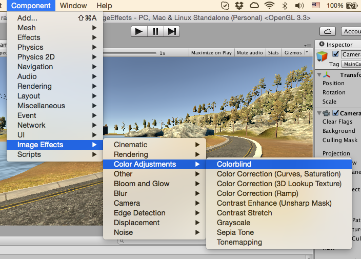

# Contents
- [Introduction](#introduction)
- [Requirements](#requirements)
- [Installation](#installation)
- [Human Vision](#human-vision)
- [Parameters](#parameters)
- [Contact Information](#contact-information)

# Introduction

Colorblind Effect (CBE) is a Fullscreen Camera Effect for Unity 5 (5.4.0 or higher)

You can buy Colorblind Effect at [Unity Asset Store]().

- Three most common types of colorblindness
- Simple setup and control
- Compatible with all Unity rendering paths (Forward, Deferred and Legacy) and anti-aliasing
- No perceptible performance hit

Up to 8% of men (and about 0.5% of women) are affected by some type of color vision deficiency. This plugin lets the designer see how is their game perceived by colorblind people.

See [forum for discussion](http://forum.unity3d.com/) and contact us at <projectwilberforce@gmail.com> for additional support.
 
# Requirements

- Unity 5 (5.4.0 or higher; all editions including Personal)
- Shader Model 3.0:  
*NVIDIA cards since 2004 (GeForce 6)*  
*AMD cards since 2005 (Radeon X1300)*  
*Intel cards since 2006 (GMA X3000)* 
- Works on desktop platforms: DirectX 9.0c and higher, OpenGL
- Windows, Mac, Linux

# Installation

1. Import from Asset Store.
2. Select your camera component.  

3. From *Component* menu select *Image Effects -> Color Adjustments -> Colorblind*.   

4. CBE effect should now be visible in the *Inspector* window.  

# Human Vision

This section contains a brief overview on how human eye perceives colors.

Eye's retina is covered with two types of cells - rod cells and cone cells. Rod cells lets us see at low light intensities while cone cells work at normal light levels. Normally cone cells come in three variants - each sensitive to different wavelengths of visible light. One for long, one for medium and one for short wavelengths (which our brain then interprets as red, green and blue colors.) This means every color we see is in fact a mix of three basic colors perceived by our eyes - this is called trichromatic vision.

Colorblind people are however missing (partially or completely) one variant of cone cells - this means that their visible color spectrum is mixed from only two colors - reducing the number of colors they can see and making it hard for them to discriminate between certain shades and colors. This is called dichromatic vision and is natural for certain kinds of animals (e.g. dogs are dichromats.)

While it is very rare, more than one variant of cone cells could be missing - such person sees effectively in black and white (monochromatic vision.) Simulating this is not covered in our plugin as it can be achieved with common grayscale effect.

This plugin simulates three main types of colorblindness - Protanopia, Deuteranopia and Tritanopia (blindness to red, green and blue respectively)

<figure>

<figcaption>Normal color vision</figcaption>
</figure>
<figure>

<figcaption>Protanopia</figcaption>
</figure>
 
<figure>

<figcaption>Deuteranopia</figcaption>
</figure>
<figure>

<figcaption>Tritanopia</figcaption>
</figure>

# Parameters

CBE plugin behaviour is controlled by a single parameter.

**Type**
Lets you switch between normal vision and various types of color vision deficiency.

# Contact Information
In case of questions or further issues, please contact us at <projectwilberforce@gmail.com>

