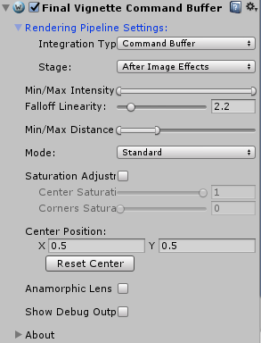

layout: finalvignettemanual
title: Final Vignette Plugin User Guide
---

# Contents
- [About Final Vignette](#about-final-vignette)
- [Requirements](#requirements)
- [Quick Start Guide](#quick-start-guide)
- [Effect How-to](#effects-how-to)
- [Controls walk-through](#controls-walk-through)
- [Contact Information](#contact-information)

# About Final Vignette

Final Vignette is our post processing effect for adding vignetting to the image for Unity 5 (5.6.0 or higher).

You can get this package at [Unity Asset Store](http://u3d.as/1bZ6).

Vignetting is an unwanted artefact of real photographic lens which displays as a decreased brightness or saturation towards image corners. While unwanted for ideal photography - this effect can improve realism of computer generated images.

Shader implementation enables control of many vignetting parameters such as vignette colors, size, intensity, saturation and position of the vignetting center.

Package comes with full source code for both C# script and the shader.

Please rate our plugin on the asset store and contact us with issues or feature suggestions. See forum for discussion and contact us at <projectwilberforce@gmail.com> for additional support.

## Requirements

- Unity 5, 2017 or 2018 (5.6 or higher; all editions including Personal)

# Quick Start Guide

1. Attach Camera Lens effect to camera using either **Add Component -> Image Effects -> Rendering -> Final Vignette** or by **dragging & dropping FinalVignette.cs file to camera**.
2. Select camera in **Hierarchy** window and use controls in **Inspector** to control the effect.

# Effect How-to

## Vignette

Vignetting displays as a reduced brightness or saturation near the corners of the image. Our implementation also lets you choose any color for center and corners.

Set desired **minimum and maximum brightness** in the corners and the center of the screen. **Falloff Linearity** controls the curve of the falloff from the center to corners (how fast is brightness reduced towards the corners). Set the **minimum and maximum distances** at which are brightness min/max values achieved.

Mode lets you select between standard brightness reduction, saturation reduction or custom colors you want to use.

It is convenient to enable debug display via **Show Debug Output** switch to fine-tune vignetting.

# Controls walk-through

## Rendering Pipeline settings

**Integration Type**

Way of integration of effect within Unity - image effect or command buffer.

## Vignette

**Min/Max Intensity**
Maximum brightness value (in the center), minimum brightness value (in the corners).

**Falloff Linearity**
Falloff curve of vignette intensity (based on distance from image center).

**Min/Max Distance**
Distance from center where minimum/maximum intensity is achieved.

**Mode**
Vignetting mode - Standard mode adjusts brightness, Saturation mode adjusts color saturation.

**Center Position**
Position of vignetting center on the screen.

**Anamorphic Lens**
Takes aspect ratio of the screen into account.

**Show Debug Output**
Displays vignetting only.

# Contact Information
In case of questions, feature requests or further issues, please contact us at <projectwilberforce@gmail.com>
