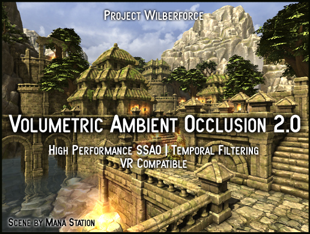

# Volumetric Ambient Occlusion 2.0 Demo

<!--
**[2017/07/11] UPDATED** *to version 1.8 (Fixed jaggy edges in single pass stereo, improved compatibility with Unity 2017)*

**[2017/18/8] UPDATED** *to version 1.7 (Improved visual quality, radius limits controls + Unity integration bugfixes)*

**[2017/19/4] UPDATED** *to version 1.6.1 (Fixed flickering and loss of detail bugs, fixed undo command)*

**[2017/23/3] UPDATED** *to version 1.6 (Command buffer implementation, Unity Post-process stack compatibility, Customizable Blur)*

**[2017/3/3] UPDATED** *to version 1.5 (Performance optimizations - adaptive sampling and downsampled pre-pass)*

**[2017/5/2] UPDATED** *to version 1.4.1 (Single Pass Stereo Rendering support for VR)*

-->

We provide a free evaluation version of our VAO Unity plugin (with watermark).

It contains all the features of a full version, except it does not run on Unity 5.6 (only Unity 2017.2 and higher). Please note that the new temporal algorithms may render a few artifacts, which are only visible in the editor - not in the play mode. This does not apply to the full version.

If you like VAO and want to use it please buy it at [Unity Asset Store](http://u3d.as/xzs) to support its development. Also let us know what you think, your feedback is welcome.

<a href="https://projectwilberforce.github.io/vaodemo/VolumetricAmbientOcclusion_2_0_Demo_Small.unitypackage" class="downloadbtn">Download Demo</a>

<!--
<a href="https://projectwilberforce.github.io/vaodemo/VolumetricAmbientOcclusion_1_8_Demo_Small.zip">Download Demo without sample scene (smaller and faster import)</a>
-->

Also See:

 - [User Manual](https://projectwilberforce.github.io/vaomanual)
 - [Asset Store Link](http://u3d.as/xzs)
 - [Forum Thread](http://forum.unity3d.com/threads/volumetric-ambient-occlusion-image-effect.428426/)
 - [Our Other Projects](https://www.assetstore.unity3d.com/en/#!/search/page=1/sortby=popularity/query=publisher:22764)

# Installation

1. From Unity menu select *Assets -> Import Package -> Custom Package...*
2. Locate and select file *VolumetricAmbientOcclusion_2_0_Demo_Small.unitypackage*  
3. Click *Import*   
5. Attach *Volumetric Ambient Occlusion* effect to *Camera* and you can change settings in the *Inspector*.
6. For more details on the settings check the plugin [user guide](/vaomanual)

# Contact Information
In case of questions or further issues, please contact us at <projectwilberforce@gmail.com>

