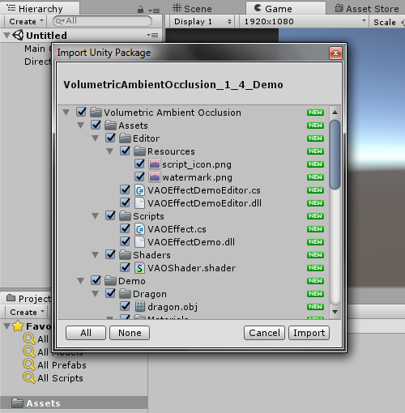

# Volumetric Ambient Occlusion 1.4 Demo

We provide a free evaluation version of our VAO Unity plugin (with watermark).

It contains all the features of a full version, except it does not run on Unity 5.3 (only Unity 5.4 and higher).

If you like VAO and want to use it please buy it at [Unity Asset Store](http://u3d.as/xzs) to support its development. Also let us know what you think, your feedback is welcome.

<a href="#" class="btn">Download Demo</a>

Also See:

 - [User Manual](/vaomanual)
 - [Asset Store Link](http://u3d.as/xzs)
 - [Forum Thread](http://forum.unity3d.com/threads/volumetric-ambient-occlusion-image-effect.428426/)

# Installation

1. From Unity menu select *Assets -> Import Package -> Custom Package...*

2. Locate and select file *VolumetricAmbientOcclusion_1_4_Demo.unitypackage*  
3. Click *Import*   

4. In your *Project* window, open *Assets -> Volumetric Ambient Occlusion -> Demo -> VAO Demo Scene*  

5. VAO is attached to Main Camera, select *Main Camera* in *Hiearchy* window and you can change settings in the *Inspector*.

6. For more details on the settings check the plugin [user guide](/vaomanual)

# Contact Information
In case of questions or further issues, please contact us at <projectwilberforce@gmail.com>

