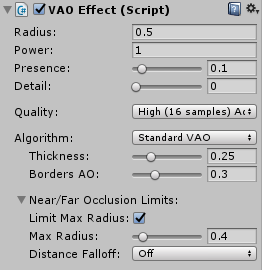
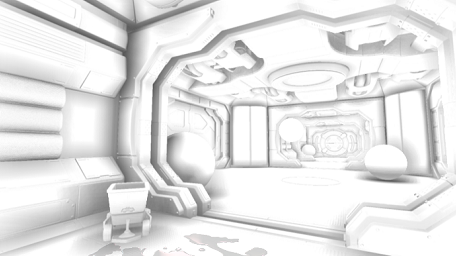

# Contents
- [Quick Start Guide](#quick-start-guide)
- [About](#about)
- [Requirements](#requirements)
- [Installation](#installation)
- [Controls walk-through](#controls-walk-through)
- [Troubleshooting](#troubleshooting)
    - [Near/Far Plane](#nearfar-plane)
    - [Radius is too low](#radius-is-too-low)
    - [Radius is too large](#radius-is-too-large)
- [Contact Information](#contact-information)

Volumetric Ambient Occlusion (VAO) is our Screen Space Ambient Occlusion for Unity 5 (5.6.0 or higher)

You can buy VAO at [Unity Asset Store](http://u3d.as/xzs).

Please rate our plugin [on Asset Store](https://www.assetstore.unity3d.com/en/#!/account/downloads/search=Volumetric%20Ambient%20Occlusion) to support its development.

# Quick Start Guide

1. Attach VAO effect to camera using either **Add Component -> Image Effects -> Rendering -> Volumetric Ambient Occlusion** or by **dragging & dropping VAOEffect.cs file to camera**.
2. Set **Radius** and **Power** to achieve desired looks - we recommend setting radius so that shadows are approx. 10cm (4 inches) large in the scene. You can use **Output AO only** toggle for fine tuning.
3. When using tone mapping, the **Presence** control can help making AO even more pronounced.
4. If you want to apply VAO before reflections, you can change **Cmd. buffer integration stage** to **Before Reflections** (Deferred rendering path only).
5. Set **Max Radius** slider so that AO has reasonable maximum size close to the camera.
6. When using large radius, you can bring back fine detail using **Detail** slider. Be aware that this affects performance.
7. You can try different algorithms for AO calculation via **Algorithm** control. We recommend using VAO algorithm for most scenes.
8. For sharper results, you can use **Basic** Blur Mode but you may need to increase quality to minimize noise.

## Performance
- Keep **Radius** reasonably low. For the best results set Radius so the shadow created by the effect is around 10-20cm (4-8in).
- For best performance, we recommend enabling **Command Buffer** option and using integration stage either **Before Reflections** or **After Lighting**.
- Use **HDR rendering** for camera.
- Do not use **Color Bleed** mode if not necessary as this is performance-wise very demanding.
- Set **Quality** so that you get smooth AO (check with Output AO Only toggle) for your radius setting. You can compensate for aliasing and jaggies by decreasing **Enhanced Blur Sharpness**
- Use **Max Radius** and **Distance Falloff** option to reduce AO further from camera to save performance.
- Use **Fast** Blur Quality option, unless artefacts occur.
- **Detail** slider needs more performance when set above 0.0 and even more above 0.5
- For more performance boost you can use **Downsampling** option, but quality will decrease dramatically.
- You can try changing other options in **Performance Settings** foldout.

## Advanced setup

- If you're experiencing occlusion on bright areas (e.g. light sources), there are more possible solutions:
  - Use HDR rendering on camera. This is recommended way.
  - When using deferred rendering path and command buffer, you can change Cmd. buffer integration stage to **After Lighting** or **Before Reflections**.
  - Turn on **Luma Sensitivity** option and fine tune parameters for best looks.

- You can give AO a color tint using **Color Tint** option.

- Try both **Blur Modes** - Standard and Enhanced to see which gives you better looks and performance.

# About

VAO improves realism and depth perception of the scene by simulating soft ambient light shadows. It accentuates details and produces shadows in the corners, cracks, holes, rough surfaces etc.

Combining classic screen-space ambient occlusion (SSAO) algorithm with a more physically based approach lets us achieve better visual quality and performance compared to classic SSAO. Volumetric approach calculates volume of occluding geometry around given point, providing more accurate shadows than traditional SSAO technique.

Online documentation can be found [here](https://projectwilberforce.github.io/vaomanual/). Please rate our plugin on the asset store and contact us with issues or feature suggestions.

VAO occlusion component only. Corridor Scene by Unity Technologies

Our adaptive sampling and downsampled pre-pass optimizations (recently published in our paper) don't waste processing time on areas with little or no occlusion - using saved processing power to make the effect even more detailed where needed.

We have fine-tuned the algorithm to work equally well for both interior and exterior scenes, so you can enjoy this effect in many types of projects.

You can give occlusion shadows a color tint to match desired atmosphere or make use of color bleeding feature for even more believable result.

VAO provides option to remove occlusion from bright areas using versatile and easily controllable function.

Now also implemented with optimizations for VR devices (including SPSR) - you can take immersion experience of your customers to the new level.

- High performance and visual quality
- Compatible with other image effects including Unity Post-Processing stack
- Compatible with all Unity rendering paths (Forward, Deferred and Legacy) and anti-aliasing
- Compatible with VR, including Single Pass Stereo Rendering
- No haloing artefacts or self-intersections
- Works well on screen borders
- Preserves shape of shadows when moving camera
- Color Bleeding mode

See [forum for discussion](http://forum.unity3d.com/threads/volumetric-ambient-occlusion-image-effect.428426/) and contact us at <projectwilberforce@gmail.com> for additional support.

## Requirements

- Unity 5 or 2017 (5.6 or higher; all editions including Personal)
- Shader Model 3.0:  
*NVIDIA cards since 2004 (GeForce 6)*  
*AMD cards since 2005 (Radeon X1300)*  
*Intel cards since 2006 (GMA X3000)*
- Works on desktop platforms: DirectX 9.0c and higher, OpenGL
- Windows, Mac, Linux
- Not tested on mobile

# Installation

1. Import from Asset Store.
2. Select your camera component.  

3. From *Component* menu select *Image Effects -> Rendering -> Volumetric Ambient Occlusion*.   

4. VAO effect should now be visible in the *Inspector* window.  

# Controls walk-through

## Parameters

VAO effect behaviour is controlled by a couple of easy to use parameters.

**Radius**

Radius sets the distance of how far the algorithm reaches to calculate occlusion and is set in **world-space units**. Therefore it is highly scene dependent and can vary from very small to large numbers. Higher radius means longer shadows caused by objects further away.

**Power**

Power variable controls the intensity of the shadow, lower value causes softer shadows.

**Presence**

Presence makes the effect more pronounced towards the crease.

Presence turned off is closer to "physically-based" solution, however, adjust this to suit your scene and desired appearance, especially when using tone mapping.

You can also try increasing presence rather than radius to make effect more visible and save performance.

**Detail**

Enhances occlusion on finely detailed features by using more samples for these areas - note that increasing slider above 0.0 costs some performance and increasing above 0.5 costs even more performance. Slider can be set independently for VAO and Raycast algorithm.

**Algorithm**

You can choose from two algorithms - standard VAO and raycast. We recommend using VAO unless you are not satisfied with the results. Raycast algorithm gives results closer to classic SSAO approach but may be more noisy and blurry.

**Thickness**

Thickness of occlusion behind what is seen by camera - controls halo around objects and 'depth' of occlusion behind objects (VAO algorithm only).

**Bias**

Bias adjustment for raycast algorithm - use to prevent self occlusion.

**Borders AO**

Amount of occlusion on screen borders - too much can cause flickering or popping when objects enter the screen.

**Quality**

Number of samples used to calculate VAO. Choose lower settings if you need faster performance.

### Near/Far Occlusion Limits

These settings control how VAO effect looks depending on surface's distance from the camera.

**Limit Max Radius**  
Enable to limit maximal radius on screen. Use this to avoid performance drops when objects come close to the camera.

**Max Radius**  
Maximal radius given as a percentage of screen area considered for occlusion (e.g. *0.33* means the sampled area will never exceed third of the screen).

**Distance Falloff**  
This gradually decreases occlusion effect after a certain distance. For example when you don't want occlusion on your background objects. This can also save performance.

- *Off*: VAO does not change based on distance.
- *Absolute*: Point of the start of the falloff is given as an absolute value in world space units - similar to camera's near/far clipping plane.
- *Relative*: Falloff start is relative the point where occlusion size would be less than one pixel (no occlusion).

Both approaches have second parameter that controls the speed of the falloff.

### Performance Settings

**Adaptive Sampling**

Adaptive sampling means lower number of samples is used on more distant areas of the image. Ideally causes no loss of detail.

- *Enabled Automatic*: Automatically determines where lower sample count should be used.
- *Enabled Manual*: Provides additional slider to fine-tune the change between the quality levels.

**Down-sampled Pre-pass**

Speeds up the calculation by down-sampling the parts without occlusion. Results in performance boost, especially for higher resolutions.

- *Greedy*: Skips areas that are not occluded. Fast, but may cause small loss of detail - white flickering squares.
- *Careful*: Computes areas with no estimated occlusion with low quality setting. Smaller performance speed-up but no loss of detail.

**Down-sampling**

Reduces resolution of output, use this to gain performance at the cost of quality. Try lowering quality parameter first as this reduces quality dramatically. Having high quality setting with down-sampling enabled is not recommended.
Alternatively, use this option if you have some sort of super-sampling enabled - as high pixel density would have adverse effect on performance without much visual impact.

**Hierarchical Buffers**  

Uses lower resolution inputs for areas close to camera to save performance with low to none impact on visual quality. **Auto** option decides automatically whether this should be turned on based on selected **Radius**. You can try turning this on/off manually to see if you get better performance for your configuration.

**Detail Quality**  

Number of samples used to calculate 'detailed shadows' set by 'Detail' control.

### Rendering Pipeline

**Command Buffer**  
Insert effect via command buffer - recommended way of using VAO, but you may turn this off for compatibility with other post processing effects.

**Normals Source**  
Normals will be taken either from Unity's built-in G-Buffer (preferred way) or recalculated from depth buffer. Recalculation can fix incorrect normals but may be less accurate.

**Cmd. Buffer Integration Stage**  
*(Applicable only for deferred rendering path and command buffer enabled).* Decides where in the rendering pipeline will be VAO calculated. *Note that for color bleeding mode only Before Image Effects Opaque event is supported.*

- *Before Reflections*: VAO will be influenced by reflections.
- *After Lighting*: VAO affects lighting of the scene before final shading happens.
- *Before Image Effects Opaque*: VAO is applied to final image.

**G-Buffer Depth&Normals**  
*(Applicable only for deferred rendering path).* Take depth and normals from G-Buffer textures, use this for better precision. This option will be sometimes automatically enabled for compatibility with other settings - especially SPSR VR rendering and some integration stages.

**High precision depth buffer**  
*(Applicable only for forward rendering path).* Uses higher precision depth buffer texture. This can fix problems with some materials not contributing to AO (see-through grass etc.).

**Far Plane Source**  

Source of Far Clipping Plane values. Some effects (notably Post-processing Stack's TAA - Temporal Anti-aliasing) alter the *[_ProjectionParams](https://docs.unity3d.com/Manual/SL-UnityShaderVariables.html)* variable which may cause flickering. If you are planning on using TAA or similar effect enable the *Camera* option to fix this.

**Luminance Sensitivity**

Reduces occlusion on bright surfaces - such as light sources or strongly lit areas. Use this to prevent occlusion on lamps, windows, screens etc. Especially when using non-HDR rendering pipeline.

- *Enable*: Toggles the effect on/off.
- *Mode*: What represents the brightness - either luminance or value component of HSV color model.
- *Threshold*: Controls the level of surface brightness that can still be occluded.
- *Falloff Width*: Width of the area in which is the occlusion gradually reduced.
- *Falloff Softness*: How fast is the occlusion reduced.

**Effect Mode**

- *Simple*: Black color occlusion.
- *Color Tint*: Custom-set occlusion color.
- *Color Bleed*: additionally to ambient occlusion, nearby surfaces "bleed" color to each other.

**Color Bleed**

Color Bleed has its own set of parameters.

**Power**  
Similar to the AO Power setting - controls the intensity of the color bleed part.

**Presence**  
Presence makes the color-bleeding more pronounced towards the crease.

**Intermediate Texture Format**  

This lets you specify texture format for mixing VAO command buffer with scene. *Auto* is recommended (handles switching between HDR by default).

**Same Color Hue Attenuation**

Provides a set of options to control color contribution based on color of source and target surfaces.

**Quality**  
Sets the size of the sample set used for the color bleed (relative to AO samples). Options are 'Normal', 'Half' and 'Quarter'.

**Dampen Self-Bleeding**  
Limits casting color on itself.

**Skip Backfaces**  
Makes surfaces cast color only in front of them - unlike shadows, that are cast both to the front and to the back.

### Blur Settings

In case you are applying your own blur after VAO effect, you can try turning this off to save performance. Blur implementations included in VAO are fast and a part of its visual appearance, so you might consider keeping it on all the time.

**Basic**  
Simple uniform 3x3 blur.

This has possibly highest performance and is very sharp, but may fail to hide some aliasing on low quality settings.

**Enhanced**  
If you need extra control over how is the occlusion blurred - with controls size and sharpness. Sizes of 3 or 5 can be faster than basic blur, but higher values will be slower. Sharpness does not affect performance.

**Output AO only**  
Use for development to display only ambient occlusion component.

## Usage tips

**Unwanted interaction with other camera effects**

You should place VAO Effect before any effects that change colors of the image such as tone mapping, vignetting, blur, chromatic aberration etc. As a rule of thumb, place VAO so that it is applied as soon as possible.

**Disabling Ambient Occlusion for specific objects**

If you don't want some object to cast or receive occlusion - set *Rendering Mode* of its material to *Fade* or *Transparent*. Or use plugin's *Luminance Sensitivity* option where possible.

# Troubleshooting

## Near/Far plane

When near and far clipping planes of the camera are too far apart, banding artifacts as seen on the picture occur. Should this happen, set the clipping planes to tightly envelop the visible scene - i.e. bring far plane as close as possible.  

Note that range of possible settings is determined by precision of depth buffer.

<figure>

<figcaption>Example of banding artifacts caused by incorrectly set far plane</figcaption>
</figure>
<figure>

<figcaption>Adjusting far plane fixes the issue</figcaption>
</figure>

## Attaching shader

When VAO effect is attached to the camera, its corresponding `VAOShader.shader` file is automatically located and bound to *VAOShader* property. If this does not happen, make sure that `VAOShader.shader` file can be found in the *Project* window under *Assets/Shaders* folder. Then bind this shader manually by drag&dropping it to *VAOShader* property in *Inspector* window.

<figure>

<figcaption>Inspector shows no attached shader</figcaption>
</figure>
<figure>

<figcaption>Should instead look like this</figcaption>
</figure>

## Radius is too low

Because VAO is screen-space based effect, there is a limited range of values that work correctly for radius setting. If radius is set too low, artifacts as seen on the picture will occur due to self-intersections. Thanks to its design this algorithm is not very susceptible to self-intersection problems, however when radius gets extremely low, no reasonable occlusions can be found.

To solve the issue, increase radius slowly until dark banded areas disappear and only correct occlusions are visible.

<figure>

<figcaption>Radius is too low to produce reasonable results</figcaption>
</figure>
<figure>

<figcaption>Scene in question after correction</figcaption>
</figure>

## Radius is too large

Because VAO is screen-space based effect, there is a limited range of values that work correctly for radius setting. When radius is too large, large dark areas will appear with no reasonable occlusions visible. 

To solve the issue, lower radius setting until correct occlusions appear in the corners, cracks etc.

<figure>

<figcaption>Setting large radius breaks the effect</figcaption>
</figure>
<figure>

<figcaption>Expected result</figcaption>
</figure>

# Contact Information
In case of questions or further issues, please contact us at <projectwilberforce@gmail.com>

