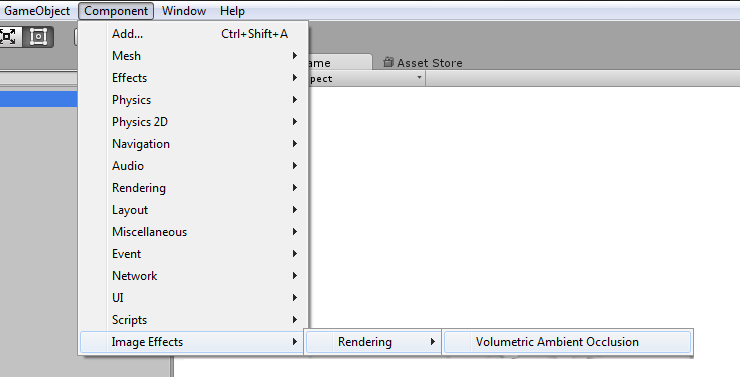

# Contents
- [Introduction](#introduction)
- [Requirements](#requirements)
- [Installation](#installation)
- [How to use](#how-to-use)
    - [Parameters](#parameters)
    - [Tips](#tips)
- [Troubleshooting](#troubleshooting)
    - [Near/Far Plane](#nearfar-plane)
    - [Attaching Shader](#attaching-shader)
    - [Radius is too low](#radius-is-too-low)
    - [Radius is too large](#radius-is-too-large)
- [Contact Information](#contact-information)

# Introduction

Volumetric Ambient Occlusion (VAO) is a post processing image effect for Unity 5 (5.0.0 or higher)

You can buy VAO at [Unity Asset Store](http://u3d.as/xzs).

VAO provides additional level of visual quality by simulating soft ambient light shadows. It accentuates local geometric detail and produces shadows by nearby occluding surfaces (in the corners, cracks, holes, rough surfaces etc.). Resulting scenes have more depth and appear more realistic.

Combining classic screen-space ambient occlusion (SSAO) algorithm with a more physically based approach lets us achieve better visual quality and performance compared to classic SSAO. 

Thanks to screen-space based solution, surface detail can be represented by normal&bump mapping instead of complex 3D geometry.

VAO is implemented as an image effect that gets attached to the camera. It features only a couple of user controlled variables, which makes it easy to control to produce the desired visual appearance - no magic variables (such as Bias).

Plugin is compatible with all Unity rendering paths (Forward, Deferred and Legacy) and anti-aliasing.

See [forum for discussion](http://forum.unity3d.com/threads/volumetric-ambient-occlusion-image-effect.428426/) and contact us at <projectwilberforce@gmail.com> for additional support.

# Requirements

- Unity 5 (5.0.0 or higher; all editions including Personal)
- Shader Model 3.0:  
*NVIDIA cards since 2004 (GeForce 6)*  
*AMD cards since 2005 (Radeon X1300)*  
*Intel cards since 2006 (GMA X3000)* 
- Works on desktop platforms: DirectX 9.0c and higher, OpenGL
- Windows, Mac, Linux
- Not tested on mobile and web platforms

# Installation

1. Import from Asset Store.
2. Select your camera component.  

3. From *Component* menu select *Image Effects -> Rendering -> Volumetric Ambient Occlusion*.   

4. VAO effect should now be visible in the *Inspector* window.  

5. If property VAO shader is not set to *"Hidden/Wilberforce/VAOShader"* see Troubleshooting section below on how to fix it.  

# How to Use

## Parameters

VAO effect behaviour is controlled by a couple of easy to use parameters.

**Radius**

Radius sets the distance of how far the algorithm reaches to calculate occlusion. Higher radius means longer shadows caused by objects further away.

**Power**

Power variable controls the hardness of the shadow, lower value causes softer shadows.

**Quality**

Number of samples used to calculate VAO. Choose lower settings if you need faster performance.

**Downsampling**

Reduces resolution of output, use this to gain performance at the cost of quality.

**Effect Mode**

- *Simple* - Black color occlusion
- *Color Tint* - Custom-set occlusion color. 

**Enable Blur**

//TODO

**Output AO only**

Use for development to display only ambient occlusion component.

|                 | **low radius**  | **high radius**
| --------------: | --------------- | ----------------
|  **low power**  |      | 
| **high power**  |      | 

## Tips

You can add the *VAO Effect* component multiple times with different settings to the same camera to create more detailed appearance.

For example, you can add *VAO effect* with short radius and another with longer one. This will create scene with both short hard and longer softer shadows.

# Troubleshooting

## Near/Far plane

When near and far clipping planes of the camera are too far apart, banding artifacts as seen on the picture occur. Should this happen, set the clipping planes to tightly envelop the visible scene - i.e. bring far plane as close as possible.  

Note that range of possible settings is determined by precision of depth buffer.

<figure>

<figcaption>Example of banding artifacts caused by incorrectly set far plane</figcaption>
</figure>
<figure>

<figcaption>Adjusting far plane fixes the issue</figcaption>
</figure>

## Attaching shader

When VAO effect is attached to the camera, its corresponding `VAOShader.shader` file is automatically located and bound to *VAOShader* property. If this does not happen, make sure that `VAOShader.shader` file can be found in the *Project* window under *Assets/Shaders* folder. Then bind this shader manually by drag&dropping it to *VAOShader* property in *Inspector* window.

<figure>

<figcaption>Inspector shows no attached shader</figcaption>
</figure>
<figure>

<figcaption>Should instead look like this</figcaption>
</figure>

## Radius is too low

Because VAO is screen-space based effect, there is a limited range of values that work correctly for radius setting. If radius is set too low, artifacts as seen on the picture will occur due to self-intersections. Thanks to its design this algorithm is not very susceptible to self-intersection problems, however when radius gets extremely low, no reasonable occlusions can be found.

To solve the issue, increase radius slowly until dark banded areas disappear and only correct occlusions are visible.

<figure>

<figcaption>Radius is too low to produce reasonable results</figcaption>
</figure>
<figure>

<figcaption>Scene in question after correction</figcaption>
</figure>

## Radius is too large

Because VAO is screen-space based effect, there is a limited range of values that work correctly for radius setting. When radius is too large, large dark areas will appear with no reasonable occlusions visible. 

To solve the issue, lower radius setting until correct occlusions appear in the corners, cracks etc.

<figure>

<figcaption>Setting large radius breaks the effect</figcaption>
</figure>
<figure>

<figcaption>Expected result</figcaption>
</figure>

# Contact Information
In case of questions or further issues, please contact us at <projectwilberforce@gmail.com>

