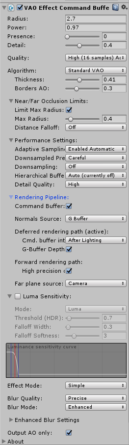
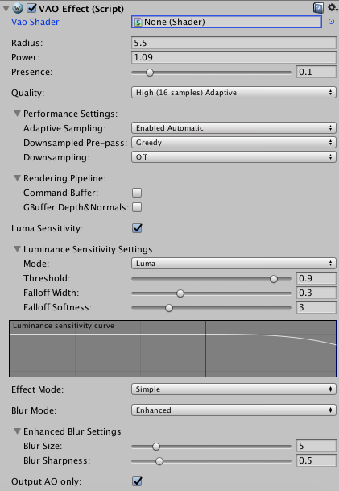
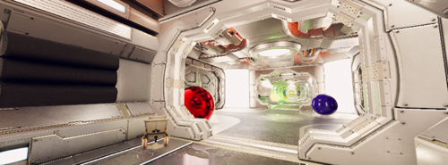

# Contents
- [Introduction](#introduction)
- [Requirements](#requirements)
- [Installation](#installation)
- [How to use](#how-to-use)
    - [Parameters](#parameters)
    - [Performance Tips](#performance-and-other-tips)
- [Troubleshooting](#troubleshooting)
    - [Near/Far Plane](#nearfar-plane)
    - [Attaching Shader](#attaching-shader)
    - [Radius is too low](#radius-is-too-low)
    - [Radius is too large](#radius-is-too-large)
- [Contact Information](#contact-information)

# Introduction

Volumetric Ambient Occlusion (VAO) is our Screen Space Ambient Occlusion for Unity 5 (5.3.0 or higher)

You can [download free demo](https://projectwilberforce.github.io/vaodemo) or buy VAO at [Unity Asset Store](http://u3d.as/xzs).

- High performance and visual quality
- Compatible with other image effects including Unity Post-Processing stack
- Compatible with all Unity rendering paths (Forward, Deferred and Legacy) and anti-aliasing
- No haloing artefacts
- No self-intersections
- No magic variables
- Works well on screen borders
- Preserves shape of shadows when moving camera
- Luminance sensitivity option
- Compatible with Unity 5.3 and higher
- Color Bleeding feature

VAO provides additional level of visual quality by simulating soft ambient light shadows. It accentuates local geometric detail and produces shadows by nearby occluding surfaces (in the corners, cracks, holes, rough surfaces etc.). Resulting scenes have more depth and appear more realistic.

Combining classic screen-space ambient occlusion (SSAO) algorithm with a more physically based approach lets us achieve better visual quality and performance compared to classic SSAO. 

Effect is compatible with normal&bump mapping, so there is no need for complex 3D geometry to create shadows.

VAO is implemented as an image effect that gets attached to the camera. It features only a couple of user controlled variables, which makes it easy to control to produce the desired visual appearance - no magic variables (such as Bias).

Plugin is compatible with all Unity rendering paths (Forward, Deferred and Legacy) and anti-aliasing.

See [forum for discussion](http://forum.unity3d.com/threads/volumetric-ambient-occlusion-image-effect.428426/) and contact us at <projectwilberforce@gmail.com> for additional support.
 
# Requirements

- Unity 5 (5.3.0 or higher; all editions including Personal)
- Shader Model 3.0:  
*NVIDIA cards since 2004 (GeForce 6)*  
*AMD cards since 2005 (Radeon X1300)*  
*Intel cards since 2006 (GMA X3000)* 
- Works on desktop platforms: DirectX 9.0c and higher, OpenGL
- Windows, Mac, Linux
- Not tested on mobile and web platforms

# Installation

1. Import from Asset Store.
2. Select your camera component.  

3. From *Component* menu select *Image Effects -> Rendering -> Volumetric Ambient Occlusion*.   

4. VAO effect should now be visible in the *Inspector* window.  

5. If property VAO shader is not set to *"Hidden/Wilberforce/VAOShader"* see Troubleshooting [section below](#attaching-shader) on how to fix it.  

# How to Use

## Parameters

VAO effect behaviour is controlled by a couple of easy to use parameters.

**Radius**

Radius sets the distance of how far the algorithm reaches to calculate occlusion. Higher radius means longer shadows caused by objects further away.

**Power**

Power variable controls the hardness of the shadow, lower value causes softer shadows.

**Presence**

Presence makes the effect more pronounced towards the crease. 

Presence turned off is closer to "physically-based" solution, however, adjust this to suit your scene and desired appearance.

You can also try increasing presence rather than radius to make effect more visible and save performance.

**Quality**

Number of samples used to calculate VAO. Choose lower settings if you need faster performance.

**Adaptive Sampling**

Adaptive sampling means lower number of samples is used on more distant areas of the image. Ideally causes no loss of detail.

- *Enabled Automatic*: Automatically determines where lower sample count should be used. 
- *Enabled Manual*: Provides additional slider to fine-tune the change between the quality levels.

**Downsampled Pre-pass**

Speeds up the calculation by downsampling the parts without occlusion. Results in performance boost, especially for higher resolutions.

- *Greedy*: Skips areas that are unoccluded in the downsampled prepass. Fast, but may cause small loss of detail. 
- *Careful*: Instead of skipping computes occlusion with low quality setting. Smaller performance speed-up but no loss of detail. 

**Command Buffer**

Insert effect via command buffer (BeforeImageEffectsOpaque event)

**GBuffer Depth&Normal**

Take depth&normals from GBuffer of deferred rendering path, use this for better precision. Note that this feature will cause some performance drop.

**Downsampling**

Reduces resolution of output, use this to gain performance at the cost of quality. Try lowering quality parameter first as this reduces quality dramatically. Having high quality setting with downsampling enabled serves no purpose.
Alternatively, use this option if you have some sort of supersampling enabled - as high pixel density would have adverse effect on performance without much visual impact.

**Luminance Sensitivity**

Reduces occlusion on bright surfaces - either light sources or strongly lit areas. We recommend enabling this in combination with downsampling to reduce the most visible artifact caused by reducing of the occlusion texture. Also use this to prevent occlusion on lamps, windows, screens etc.

- *Enable*: Toggles the effect on/off.
- *Mode*: What represents the brightness - either luminance or value component of HSV color model.
- *Threshold*: Controls the level of surface brightness that can still be occluded.
- *Falloff Width*: Width of the area in which is the occlusion gradually reduced.
- *Falloff Softness*: How fast is the occlusion reduced.

Try moving the sliders to see the difference:

<iframe frameborder="0" class="juxtapose" width="100%" height="380" src="https://cdn.knightlab.com/libs/juxtapose/latest/embed/index.html?uid=ff4980d6-9947-11e6-9008-0edaf8f81e27"></iframe>
<iframe frameborder="0" class="juxtapose" width="100%" height="380" src="https://cdn.knightlab.com/libs/juxtapose/latest/embed/index.html?uid=137d9cf4-9948-11e6-9008-0edaf8f81e27"></iframe>

<!--
<figcaption>Without VAO enabled</figcaption>

<figcaption>VAO with luminance sensitivity</figcaption>

<figcaption>VAO without luminance sensitivity</figcaption>

-->

**Effect Mode**

- *Simple*: Black color occlusion.
- *Color Tint*: Custom-set occlusion color. 
- *Color Bleed*: Additionaly to ambient occlusion, nearby surfaces "bleed" color to each other.

**Color Bleed**

Color Bleed has its own set of parameters.

- *Power*: Similar to the AO Power setting - controls the intensity of the color bleed part.
- *Quality*: sets the size of the sample set used for the color bleed (relative to AO samples). Options are 'Normal', 'Half' and 'Quarter'.
- *Skip Backfaces*: Makes surfaces cast color only in front of them - unlike shadows, that are cast both to the front and to the back. See attached screenshots.

<iframe frameborder="0" class="juxtapose" width="100%" height="380" src="https://cdn.knightlab.com/libs/juxtapose/latest/embed/index.html?uid=28461d04-d41d-11e6-892e-0edaf8f81e27"></iframe>

**Blur Mode**

In case you are applying your own blur after VAO effect, you can try turning this off to save performance. Blur implementations included in VAO are fast and a part of its visual appearance, so you might consider keeping it on all the time.

**Basic**

Simple uniform 3x3 blur

**Enhanced**

If you need extra control over how is the occlusion blurred - with controls size and sharpness. Sizes of 3 or 5 can be faster than basic blur, but higher values will be slower. Sharpness does not affect performance.

**Output AO only**

Use for development to display only ambient occlusion component.

|                 | **low radius**  | **high radius**
| --------------: | --------------- | ----------------
|  **low power**  |      | 
| **high power**  |      | 

## Performance and other tips

**Performance tips**

- Keep radius reasonably low. For the best results set *Radius* so the shadow created by the effect is around 10-20cm (4-8in).
- To make AO effect more pronounced increase *Presence* and *Power* settings before increasing *Radius*.
- Use appropriate number of samples (*Quality* setting) - high enough to hide aliasing. There is nothing wrong with using 4-8 samples when radius is small enough.
- Consider using *Downsampling* at high screen resoltions.
- Judge the quality by the final image, not AO only.
- Use *Adaptive Sampling* and *Downsampled Pre-pass* feature.

**Unwanted interaction with other camera effects**

You should place VAO Effect before any effects that change colors of the image such as tone mapping, vignetting, blur, chromatic aberration etc. As a rule of thumb, place VAO so that it is applied as soon as possible. 

**Disabling Ambient Occlusion for specific objects**

If you don't want some object to cast or receive occlusion - set *Rendering Mode* of its material to *Fade* or *Transparent*. Or use plugin's *Luminance Sensitivity* option where possible.

# Troubleshooting

## Near/Far plane

When near and far clipping planes of the camera are too far apart, banding artifacts as seen on the picture occur. Should this happen, set the clipping planes to tightly envelop the visible scene - i.e. bring far plane as close as possible.  

Note that range of possible settings is determined by precision of depth buffer.

<figure>

<figcaption>Example of banding artifacts caused by incorrectly set far plane</figcaption>
</figure>
<figure>

<figcaption>Adjusting far plane fixes the issue</figcaption>
</figure>

## Attaching shader

When VAO effect is attached to the camera, its corresponding `VAOShader.shader` file is automatically located and bound to *VAOShader* property. If this does not happen, make sure that `VAOShader.shader` file can be found in the *Project* window under *Assets/Shaders* folder. Then bind this shader manually by drag&dropping it to *VAOShader* property in *Inspector* window.

<figure>

<figcaption>Inspector shows no attached shader</figcaption>
</figure>
<figure>

<figcaption>Should instead look like this</figcaption>
</figure>

## Radius is too low

Because VAO is screen-space based effect, there is a limited range of values that work correctly for radius setting. If radius is set too low, artifacts as seen on the picture will occur due to self-intersections. Thanks to its design this algorithm is not very susceptible to self-intersection problems, however when radius gets extremely low, no reasonable occlusions can be found.

To solve the issue, increase radius slowly until dark banded areas disappear and only correct occlusions are visible.

<figure>

<figcaption>Radius is too low to produce reasonable results</figcaption>
</figure>
<figure>

<figcaption>Scene in question after correction</figcaption>
</figure>

## Radius is too large

Because VAO is screen-space based effect, there is a limited range of values that work correctly for radius setting. When radius is too large, large dark areas will appear with no reasonable occlusions visible. 

To solve the issue, lower radius setting until correct occlusions appear in the corners, cracks etc.

<figure>

<figcaption>Setting large radius breaks the effect</figcaption>
</figure>
<figure>

<figcaption>Expected result</figcaption>
</figure>

# Contact Information
In case of questions or further issues, please contact us at <projectwilberforce@gmail.com>

