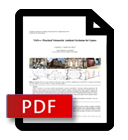

# VAO++: Practical Volumetric Ambient Occlusion for Games

Jakub Bokšanský, Adam Pospíšil and Jiří Bittner

## Paper

<div style="display: inline;">
	<a href="VAOPlusPlus.pdf">
		
	</a>
</div>

<div style="display: inline; top: 20px; left: 10px; position: relative;">
Downloadable PDF version of <a href="VAOPlusPlus.pdf">paper here</a>.<br />  
<span style="position: relative; top: 5px;">Preprint for Eurographics Symposium on Rendering - Experimental Ideas & Implementation (2017)</span>
</div>

## Abstract

<div style="text-align: justify; font-style: italic;">
Ambient occlusion is one of the commonly used methods to increase visual fidelity in real-time rendering applications. We propose several extensions of the recently introduced volumetric ambient occlusion method. These extensions improve the properties of the methods with a particular focus on the quality vs performance tradeoff and wide applicability in contemporary games. We describe the implementation of the proposed algorithm and its extensions. We implemented the method as a camera effect within the Unity game engine. The results show that our implementation compares favorably with the standard ambient occlusion in Unity both in terms of quality and speed.
</div>

## Video

<div style="text-align: center;">
	<iframe width="560" height="315" src="https://www.youtube.com/embed/RHXVSfM1Jyg" frameborder="0" allowfullscreen></iframe>
</div>

## Bibliography
```
@inproceedings{EGSR-Experimental_Ideas_Implementations:031-039:2017,
crossref = {EGSR-Experimental_Ideas_Implementations-proc},
title = {{VAO++: Practical Volumetric Ambient Occlusion for Games}},
author = {Jakub Bokšanský and Adam Pospíši­l and Jiří Bittner},
pages = {031-039},
year = {2017},
note = {\httpAddr{https://diglib.eg.org/bitstream/handle/10.2312/sre20171192/031-039.pdf}},
DOI = {10.2312/sre.20171192},
}
```

## Our implementation

Implementation as Unity plugin is available as a [free demo](../vaodemo) or on the [Asset Store](https://www.assetstore.unity3d.com/en/#!/content/67927).

## Contact Information
In case of questions or further issues, please contact us at <projectwilberforce@gmail.com>

