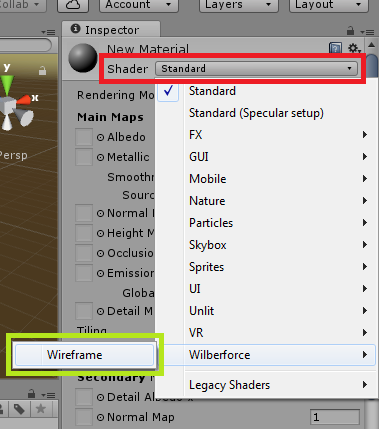
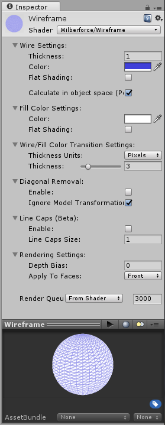
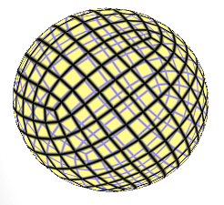
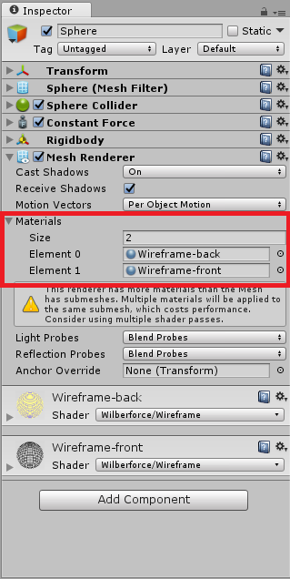

# Contents
- [Introduction](#introduction)
- [Requirements](#requirements)
- [Installation](#installation)
- [Parameters](#parameters)
- [How to](#how-to)
- [Contact Information](#contact-information)

# Introduction

Wilberforce Wireframe (WW) is a Shader for Unity 5 (5.3.6 or higher)

You can buy Wilberforce Wireframe at [Unity Asset Store](https://www.assetstore.unity3d.com/#!/content/81663).

Please rate our plugin [on Asset Store](https://www.assetstore.unity3d.com/en/#!/account/downloads/search=Final%20Wireframe) to support its development.

Wilberforce Wireframe is currently in Beta and your feedback is welcome! Please share your ideas and features you would like to see with us at <projectwilberforce@gmail.com>.

Features:

- Blending between wirecolor and fillcolor
- Supports Transparent Render Queue
- Option for removing diagonal edges
- Option for perspective display of lines (line appears thinner as distance from camera increases)
- Flat shading of the fill color
- Rendering of back faces (transparent double-sided objects)

Planned features (FUTURE):

- Interaction with scene lights
- Phong shading (single-pass optimization), including textures
- Better lines caps
- Dashed lines
- Better diagonal edges removal method
- Alternative calculation supporting DirectX 9 level hardware

See [forum for discussion](https://forum.unity3d.com/threads/wilberforce-wireframe-shader-material.460092/) and contact us at <projectwilberforce@gmail.com> for additional support.
 
# Requirements

- Unity 5 (5.3.6 or higher; all editions including Personal)
- Works on following graphic APIs: *DirectX 11*, *DirectX 12*, *OpenGLCore*, *OpenGLES3*
- Windows, Mac, Linux

# Installation

1. Import from Asset Store.
2. Create new material
3. Select created material
4. In inspector window set shader property to `Wilberforce/Wireframe`  
  
5. Apply material to mesh by drag&dropping to desired object in hierarchy window or choosing it in the mesh inspector
6. Check included demo scenes on possible usage

# Parameters

WW material behaviour is controlled by following parameters:

  

**Wire Thickness**
How thick the line appears.

**Wire Color**
Color of the line (can be transparent)

**Fill Color**
Color of the rest of the face (can be transparent)

**Remove Diagonals**
Skips longest triangle edges to create a quad wireframe

**Apply Flat Shading**
Faces are shaded based on their orientation to camera.

**Calculate in Object Space (Perspective)**
Perspective display - line appears thinner as distance from camera increases.

**Show Line Caps (beta)**
Switch on to display line caps (making the line thicker in the corners)

**Line Caps Size**
How thick the line caps are.

**Apply to faces**
On what surfaces of the mesh will be effect applied.

`Front`: default option; `Back`: use to make a backface material for "see-through" double-sided mesh.

# How to
## Basic usage
Using the shader is straightforward - simply assign shader as described in Installation section and adjust parameters.

Note that you can combine wireframe shader material with another materials on same object (by setting fill color to transparent, you can make underlying material visible).

## Transparent objects (Double-sided mesh)

Most interesting effect can be achieved by rendering the object transparent, with wireframe edges visible. To achieve this, you have to apply this shader twice - once for front faces with transparent fill color and second time for back faces:

1. Create two separate materials and assign `Wilberforce/Wireframe` shader to them
2. Set Apply to faces parameter to `Front` for one material, `Back` for another.
3. Set fill color to transparent (or semi-transparent) for material with `Front` faces rendering
4. Select object you want to render and open `Materials` section in Inspector Window. Set `Size` parameter to 2 (or more)
5. Assign our two materials to selected object (see picture below)

# Contact Information
In case of questions or further issues, please contact us at <projectwilberforce@gmail.com>

